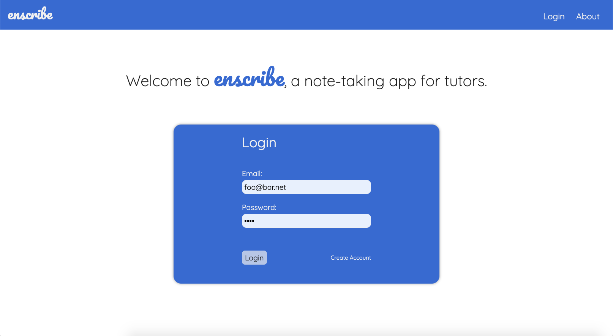

# Enscribe

**Enscribe** is a tool for tutors to share lesson notes with their students.

Built by Andrew Johnson, John Blake, Brian Lynn, and Laura Elias.

This app is perfect for instructors who work with students one-on-one!

## How it works

Instructors can add students to their rosters via email.

Select a student to open their directory of lessons where the you can add lessons and notes.

### [Live Deployment](https://pure-wave-91989.herokuapp.com/)

### Tech Used:

- Express
- Sequelize
- Handlebars
- **Passport**
- **SendMail**

\*_bold package names are new technologies_

### Interesting Things to Check Out:

- **resolveUser.js** middleware
- User-level resource auth-guard provided by **isNotImposter()**, **hasStudent()**, and **hasLesson()** in **protectedRoutes.js**
